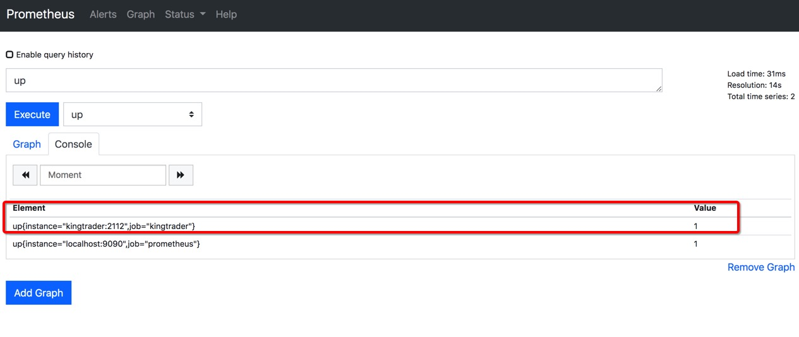
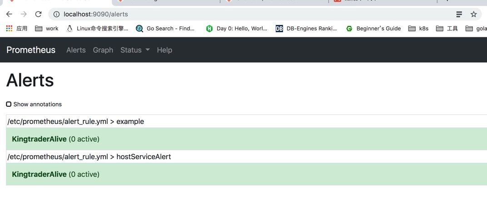
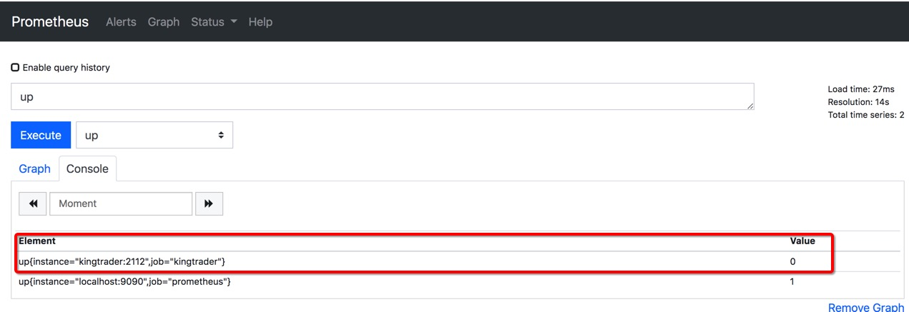
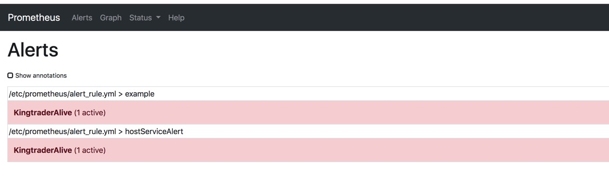

## prometheus 报警监控实践

    这是个练手的项目，主要用来理解prometheus的监控报警流程及配置，使用docker-compose 快速上手，实现微信以及email报警。本文的主要目的，一是记录， 二时帮助新手来理解报警监控。

    本项目只监控了 target-go 停止后， 会不会报警，及报警后的处理，更多的指标监控， 请移步 [prometheus 文档](https://prometheus.io/docs/introduction/overview/)


    本项目涉及到的知识点：
    
    1. docker-compose 编排管理docker服务

    2. prometheus 指标采集

    3. prometheus 报警管理 

### 文件目录结构

```
.
├── alertmanager/
├── docker-compose.yml
├── grafana/
├── mysql/
├── mysql-export/
├── prometheus/
├── readme.md
└── target-go/

```

- alertmanager/ : prometheus 的 报警管理器，负责报警信息归集，发送通知等
- prometheus/   : docker 启动的 prometheus 服务， 收集监控信息，根据监控信息发送报警
- target-go/    : go 启动的一个web服务，被监控对象，docker-compse中服务名称为 kingtrader, 在这个项目中，可以通过启动和停止 kingtrader,该项目来观察 prometheus的监控和报警结果
- docker-compose.yml ： 通过 docker-compose 管理管理上面的服务


### 修改配置

- 启动docker， clone 仓库到本地目录，假如是prom

- 修改 alertmanager 报警通知相关的配置文件

alertmanager/conf/alertmanager.yml
```
///////////////////////////// 发送邮件  /////////////////////////////

// 修改发送配置
  smtp_from: '发送人'
  smtp_smarthost: '发送服务器'
  smtp_auth_username: '账号'
  smtp_auth_password: "密码"

// 接收者

receivers:
- name: 'manager'
  email_configs:
  - send_resolved: false
    to: 接收人email

///////////////////////////// 发送微信消息  /////////////////////////////
  ## 修改 wechat 
  # wechat_api_url: <string> | default = "https://qyapi.weixin.qq.com/cgi-bin/" 
  # wechat_api_secret: <secret> 
  # wechat_api_corp_id: <string> 

```

### 运行并观察

- 进入 prom,启动服务
```
    cd prom
    docker-compose up 
```

- 浏览器中 [查看监控指标](http://localhost:9090/graph?g0.range_input=1h&g0.expr=up&g0.tab=1)






- 停止 kingtrader 再次查看
```
    docker-compose stop kingtrader
```






- 不出意外的话，过5分钟就能收到报警信息啦